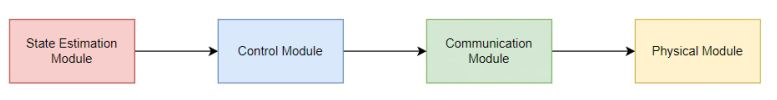
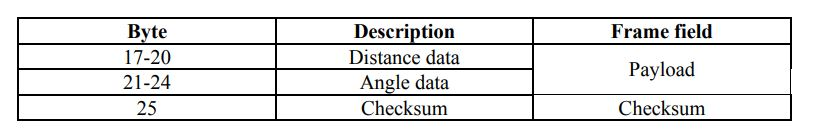
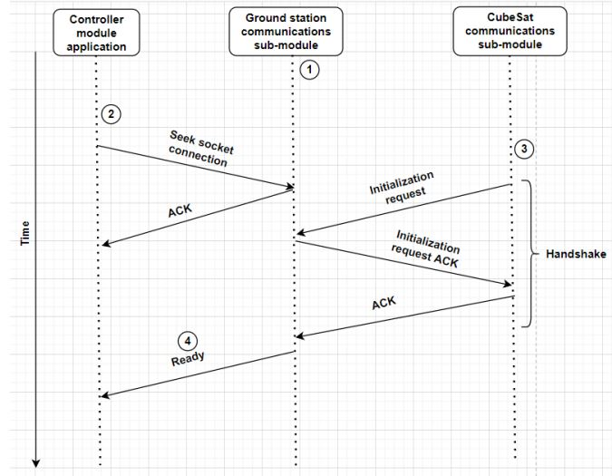

# CubeSat Cold Gas Propulsion System
### Overview
The goal of the Cold Gas Propulsion System (CGPS) is to move a CubeSat, a miniature satellite to a desired location. This is accomplished by generating a force opposite to the direction of desired motion by firing one or more thrusters that expel a cold gas propellant. The following is a block diagram of the system

A key component of this system is the communication module that is responsible for receiving a sequence of directions from the control module running on a ground station computer and communicating it with the physical module that is contained within the CubeSat. 

### Communication Module
There are two components to the communication module - the ground station communications sub-module and the satellite communications sub-module. On the ground station, both the control module and ground station sub-module run on the same computer and communicate using network sockets.  

Communication between the ground station and satellite is performed using RF signals. XBee RF Links are used to accomplish this. The RF Link connects to the ground station computer through a USB interface, and through a UART interface on the satellite.

The control module sends distance and angle data to the ground station sub-module and a transmit frame containing the payload is constructed and transmitted. Payload and checksum fields of the frame are as follows:

Communication initialization involves a handshake between the control module as well as both communication sub-modules as shown in the following diagram:

### Testing
During final testing, this module was able to meet all the performance metrics that were established and served as an effective and cost-efficient means of communication between the ground station and the satellite.
